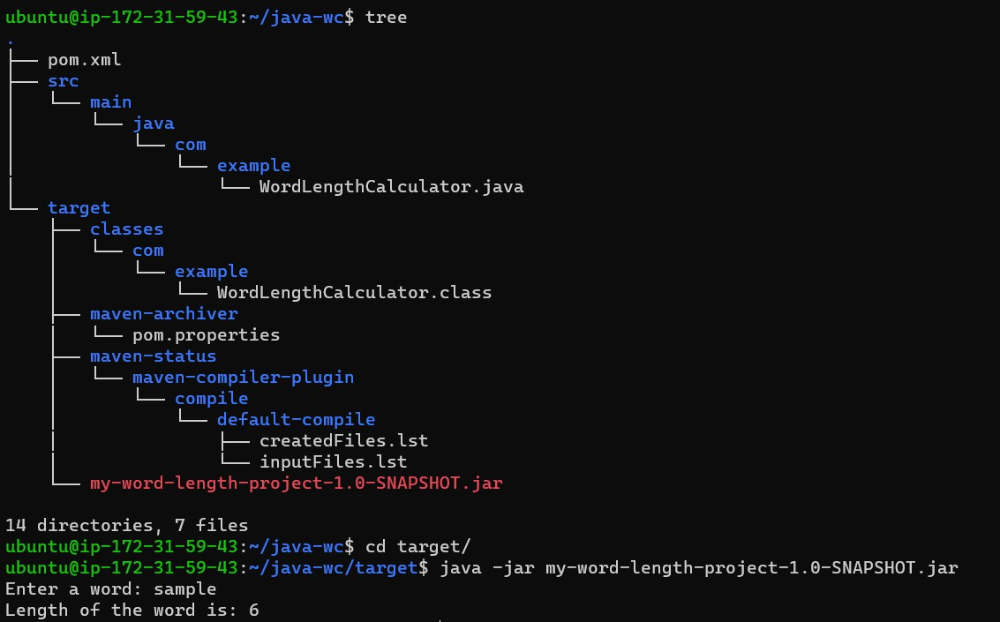

# Word Length Calculator Project




The Word Length Calculator is a simple Java application that calculates the length of a given word. This project utilizes Maven for dependency management, building, and packaging the application into a runnable JAR file.

## Prerequisites

- Java Development Kit (JDK) 8 or later installed on your machine for development.
- Java Runtime Environment (JRE) 8 or later installed on the target machine to run the application.
## 1. Project Creation

Create a new Maven project by running the following command:
```bash
mvn archetype:generate -DgroupId=com.example -DartifactId=my-word-length-project -DarchetypeArtifactId=maven-archetype-quickstart -DinteractiveMode=false

```
## 2. Update `pom.xml`

Open the `pom.xml` file and specify the Java version and add the `maven-jar-plugin` to include the `Main-Class` attribute in the manifest file.
```xml
<!-- ... other elements ... -->

<properties>
    <maven.compiler.source>1.8</maven.compiler.source>
    <maven.compiler.target>1.8</maven.compiler.target>
</properties>

<build>
    <plugins>
        <!-- ... other plugins ... -->
        <plugin>
            <groupId>org.apache.maven.plugins</groupId>
            <artifactId>maven-jar-plugin</artifactId>
            <version>3.1.0</version>
            <configuration>
                <archive>
                    <manifest>
                        <addClasspath>true</addClasspath>
                        <classpathPrefix>lib/</classpathPrefix>
                        <mainClass>com.example.WordLengthCalculator</mainClass>
                    </manifest>
                </archive>
            </configuration>
        </plugin>
    </plugins>
</build>

<!-- ... other elements ... -->

```
## 3. Implementing the Application

Create a file `WordLengthCalculator.java` under `src/main/java/com/example` and implement your logic.
```java
package com.example;

public class WordLengthCalculator {
    public static void main(String[] args) {
        if (args.length != 1) {
            System.out.println("Usage: java WordLengthCalculator <word>");
            return;
        }
        String word = args[0];
        System.out.println("The length of '" + word + "' is " + word.length());
    }
}

```
## 4. Building and Packaging

Run the following command to build and package your application into a JAR file:
```bash
mvn clean package

```
## 5. Running the Application

On your development machine, you can run the application using the following command:
```bash
java -jar target/my-word-length-project-1.0-SNAPSHOT.jar <word>

```
## 6. Running on Other Machines

- Copy the `target/my-word-length-project-1.0-SNAPSHOT.jar` file to the other machine.
- Ensure that the other machine has Java Runtime Environment (JRE) 8 or later installed.
- Run the application using the following command:
```bash
java -jar my-word-length-project-1.0-SNAPSHOT.jar <word>
